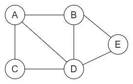

# Grafos

Grafos são estruturas de dados utilizadas para representar a teoria dos grafos da matematica.

É possivel pensar neles com um par de conjuntos: um conjunto de _vertices_ e um conjunto de _arestas_.

Cada _vertice_ pode representar uma informação diferente e essa informação pode ser ligada a outras atraves de uma _aresta_.

Vejamos um exemplo.

O grafo possui 5 vertices e 7 arestas.

# Tipos de grafos

Existem varios tipos de grafos dentro da computação, porém dois dos mais importantes são o _grafo não dirigido_ e o _grafo dirigido (digrafo)_.

### Digrafos

Nos grafos dirigidos as arestas possuem uma direção.

### Grafos não dirigidos

Não possuem direção, é possivel caminhar para ambos os lados de uma aresta.
Exemplo:

